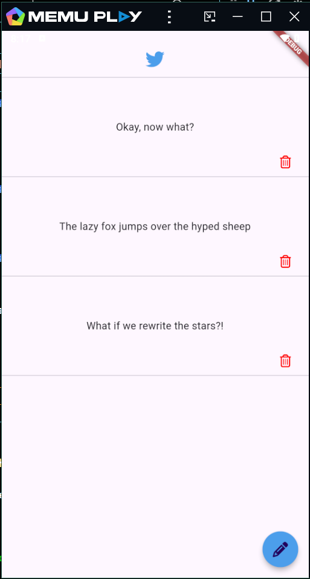
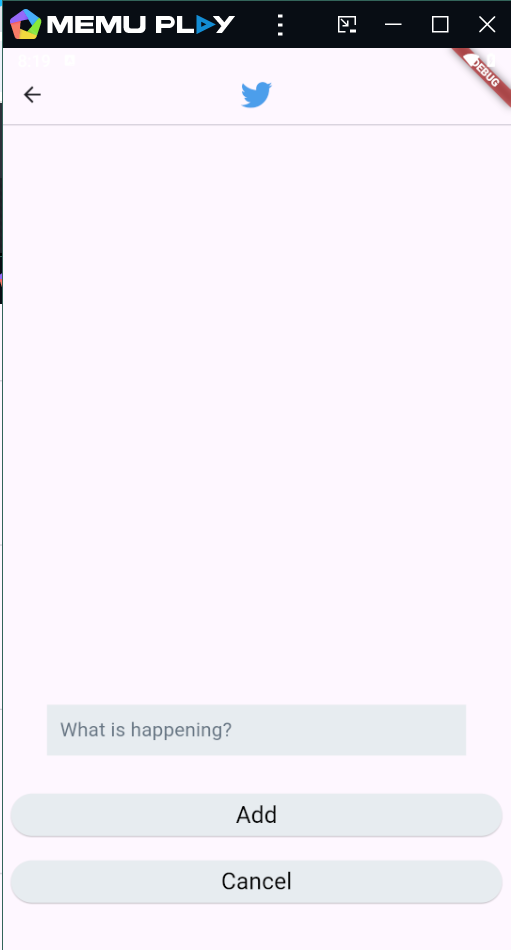
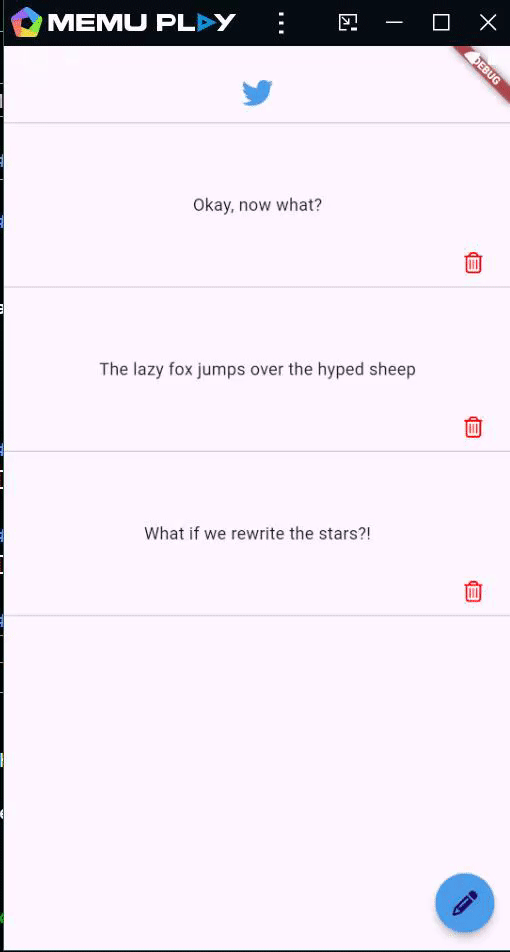

# Tweet Management App

A simple Flutter application for managing tweets. Users can add new tweets, view existing ones, and delete tweets. The app utilizes `GetIt` for dependency injection and `GetStorage` for local storage.

## Features

- **Add New Tweets**: Users can input and save new tweets.
- **View Tweets**: Display a list of existing tweets.
- **Delete Tweets**: Remove tweets from the list. method used is removeWhere((id == id)) to remove it from the list. 

## Technologies Used

- **GetIt**: Service locator for managing state and dependencies.
- **GetStorage**: Local storage solution for persisting tweet data.

### `TextFieldCustom`

- **TextField**: Customized text field with styling for user input.

### `CustomButton`

- **ElevatedButton**: Custom-styled button used for actions like adding or canceling tweets.

# Here is how it looks 

## 1 

## 2 

## 3

