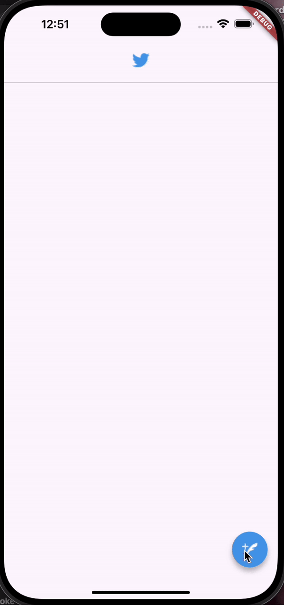

<p align="center">

<br/>

# get_it application

 The main goal of this application is to be familiar with get_it and get_storage libraries. 

## Requirements

 In order to run the application, this project requires a Dart SDK, Flutter SDK and a command line interface (CML).

## install dart SDK
 install dart SDK from [dart documentation](https://dart.dev/get-dart)

 ## install flutter SDK
 install or upgrade the latest version of Flutter from these installation [guides](https://docs.flutter.dev/get-started/install)

## How to run the project

1. Open terminal or CMD.
2. Navigate to the project path, such as 
```bash
cd /Users/amjadelahi/flutter_bootcamp/get_it-Assignment/get_it_assignment
```
 3. Run the application with a command: 
```bash
flutter run
```
 ## Widgets 
The widgets that are used:

| Widget | Description |
| --- | --- |
| Scaffold | Used to construct the fundamental visual layout structure of the material design |
| Column | Presents the components in a vertical array |
| Text | Displaying and styling text |
| SizedBox | Provide some distance between the two widgets, place an empty Sized Box between them |
| Container | Similar to a box used to store things |
| Padding | Add space around widget |
| Row | Presents the components in a horizental array |
| Divider | Creates a thin horizontal line that's usually used to divide content in lists or between UI components |
| Image.asset | Used to display images from the assets directory of your project |
| ElevatedButton | Used for actions that are important and need user attention |
| AppBar | used to create a material design app bar at the top of an application screen |
| FloatingActionButton | Its a circular button that floats above the content of  application |
| Stack | Allows you to overlay multiple widgets on top of each other |

## External Libraries
1. get_it
2. get_storage

## Output 

<p align="center">

<br/>


## created by
Amjad Noor Elahi
