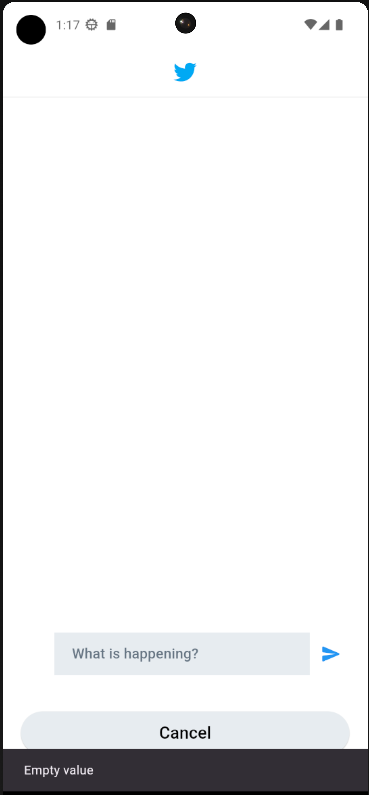
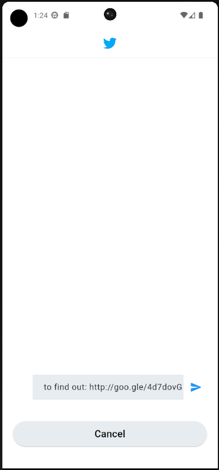

# Twitter UI

## Overview

### Purpose
The purpose of this app is to practice on local storage using `get_it` & `get_storage` packages.

### Features
- Add Tweets: Users can create and post new tweets.

- Remove Tweets: Users can remove their tweets.

- Local Storage: The app store and update the tweets localy .

## Widgets & External Packages

### Main Widgets
- **TextField**: The `TextField` widget is used to allow users to input text.

- **SnackBar**: The `SnackBar` is used to show error message to the users.



### External Packages
- **get_it**: Is a simple Service Locator for Dart and Flutter projects.

- **get_storage**: A fast, extra light and synchronous key-value in memory, which backs up data to disk at each operation. It is written entirely in Dart and easily integrates with Get framework of Flutter.

- **Icons Plus**: Is a package for Flutter developers that provides a collection of attractive icons from different packs.

## Instructions for Running the App

### Prerequisites
- Flutter SDK

### Running the App
1. Clone the repository: 
   ```bash
   git clone https://github.com/Basel-75/get_it-Assignment.git
2. Navigate to the project directory: 
   ```bash
   cd get_it-Assignment

3. Install dependencies: 
   ```bash
   flutter pub get

4. Run the app on an emulator or connected device: 
   ```bash
   flutter run


## Output

### Screenshot




### Demo GIF


## License

This project is licensed under the MIT License - see the [LICENSE](LICENSE) file for details.

## Contact

For more information, feel free to contact me via basel_1422@outlook.com or visit my GitHub profile @Basel-75.