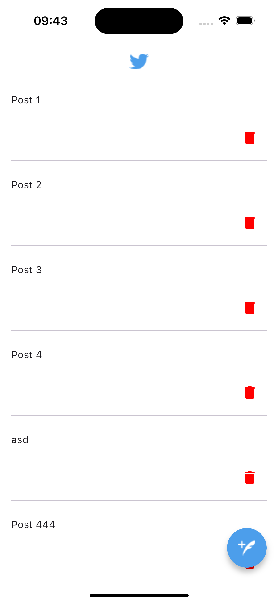
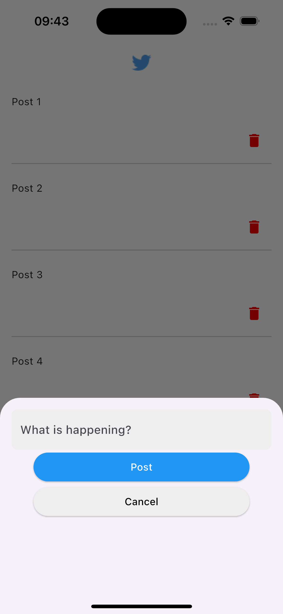

# Tweet Management App

## Project Overview

This Flutter application allows users to manage a list of tweets. Users can add new tweets and remove existing ones,
with all data being stored locally using GetStorage.

## Features

- Add new tweets to the list
- Remove tweets from the list
- Local data persistence using GetStorage
- Simple and intuitive user interface

## Getting Started

1. Clone the repository
2. Run `flutter pub get` to install dependencies
3. Launch the app using `flutter run`

## Dependencies

- Flutter
- GetStorage for local data persistence
- GetIt for dependency injection

## Project Structure

- `lib/`: Contains the main Dart code
    - `main.dart`: Entry point of the application
    - `screens/`: UI screens
    - `models/`: Data models
    - `services/`: Business logic and data handling

## How to Use

1. Launch the app
2. Tap the floating action button to add a new tweet
3. Enter your tweet in the bottom sheet and press 'Post'
4. To delete a tweet, swipe left on the tweet in the list

## ScreenShots

