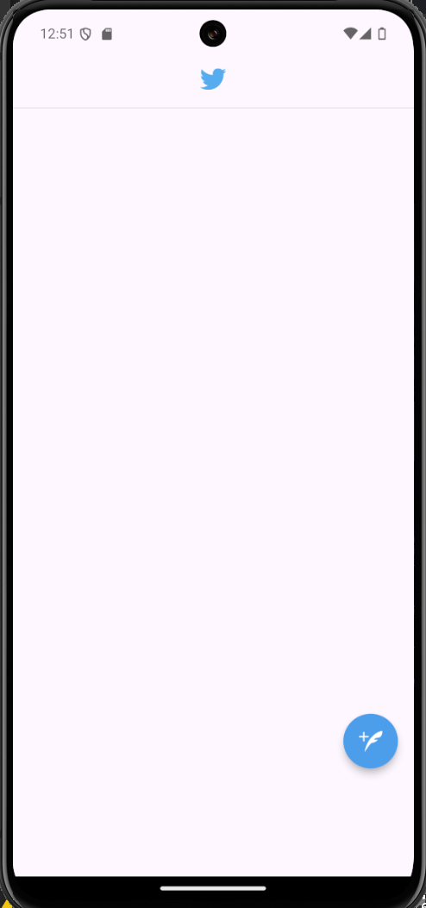
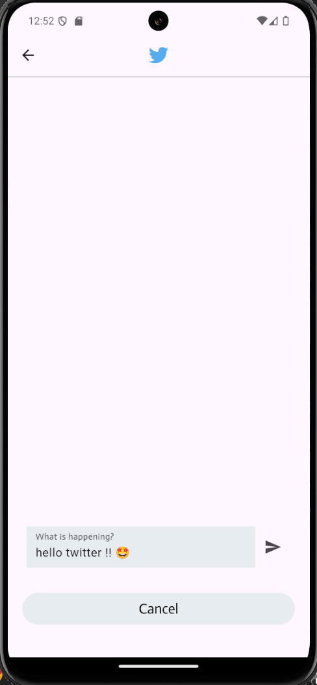
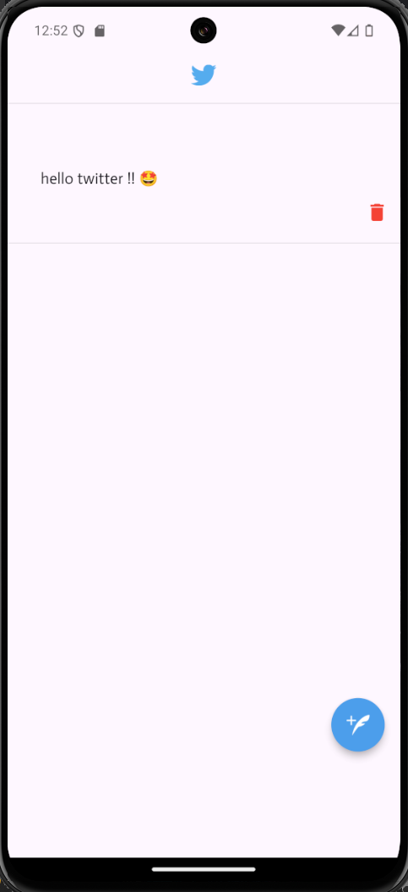
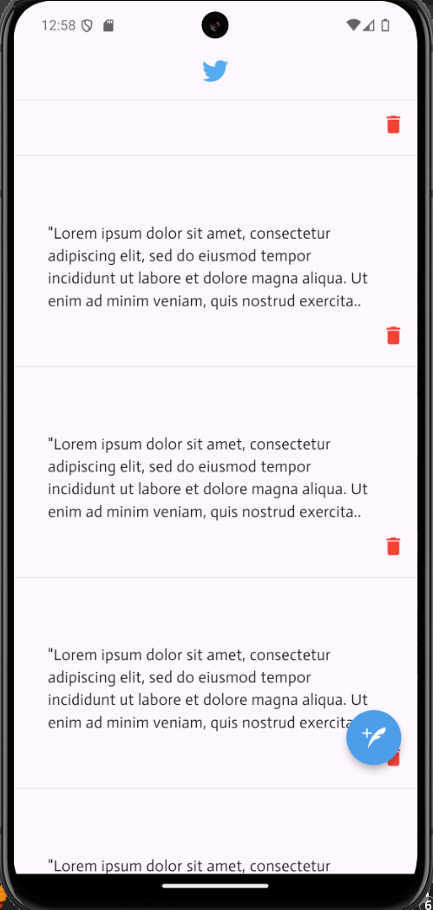

# Assignment : get_it

## 1. Overview 📖
Local storage in apps is a necissety since no user will ever use an application that doesn't save their data !. In this Twitter-Like app, we are using get_it and get_storage packages to store user tweets and manipulate (add/delete) them.

## 2. Main Features 📱
- **Add Tweet** : Users can add tweets to their tweets list / timeline.
- **Delete Tweet** : Users can delete tweets from their tweets list / timeline.

## 3. Results ⭐

## 3.1 Screenshots 📸

**Home Page 🏠**

**Typing a tweet ✍️**

**Adding a tweet 🆕**

**Multiple tweets 🐦**

## 3.2 Video 🎥
<video controls src="readme_media/RESULTS.mp4" title="Results"></video>

## 4. Conclusion 🏁
get_it and get_storage packages are really helpful and reliable in storing user data, ensuring that each time the user opens the app, all their data are loaded.

**Author : Yaser Alkhayyat**