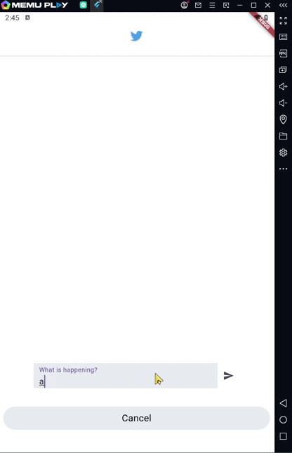

# GetIt & Get_Storage Packages

**Screens:**

<li>Home Screen: This screen will show the tweets if there's data will display it and can Remove the tweets 
<li>Tweet Screen: adding a tweets and by default will pop to Home Screen

**Packages used:**
#### <li>GetIt
#### <li>Get_Storage
