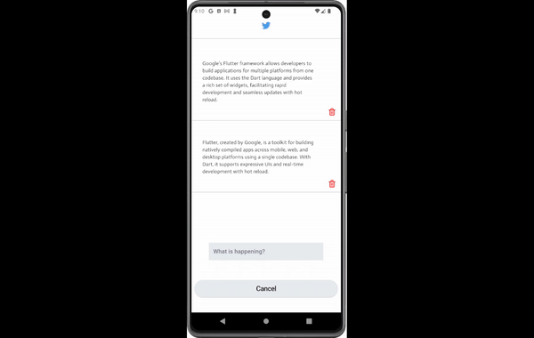

# Simple Twitter App

## Description

Twitter-like app to add and display tweets, deletion of tweets is an option too.

# Work

## Screens
### LandingScreen
- This Screen serves as a loading screen
- It contains twitter logo that stays for 3 seconds then redirects user to HomeScreen
- Flutter Animate is used here

### HomeScreen
- A place to add and display tweets

## Helper

### get_it.dart
- Get it package is used to locate services from any screen of the app
- It is used for TweetData, to make adding and deleting of tweets much easier to access

### get_storage package
- Used as a local database, an instance of type GetStorage is created to store app's data
- It saves tweet to the box, and upon starting the app, it loads data to the box

### extensions
- screen.dart
- For easier access to height and width of MediaQuery

### Models
- Tweet and TweetData
- Each Tweet has an id and content, and TweetData has a list of Tweet objects

### Widgets
- tweet_bottomsheet.dart
- A custom widget to give user space to type the tweet
- Input Handling is done here, to make sure the tweet is not empty
- AlertDialog is shown when empty
- The bottomSheet goes up with the keyboard so that the user can see what they're typing (done by setting viewInsets to bottom in padding property) 

### Packages
- flutter_animate: ^4.5.0
- get_it: ^7.7.0
- get_storage: ^2.1.1
- google_fonts: ^6.2.1
- icons_plus: ^5.0.0

# Gif of UI and functionality

## Help
If you encounter any issues:
- Make sure you have all the necessary dart files within the project
- Contact us so that we can help resolve the problem

## Authors
Abdulaziz Alamri

## Version History
**See commits history for more details**

## Acknowledgments
Tuwaiq Academy

