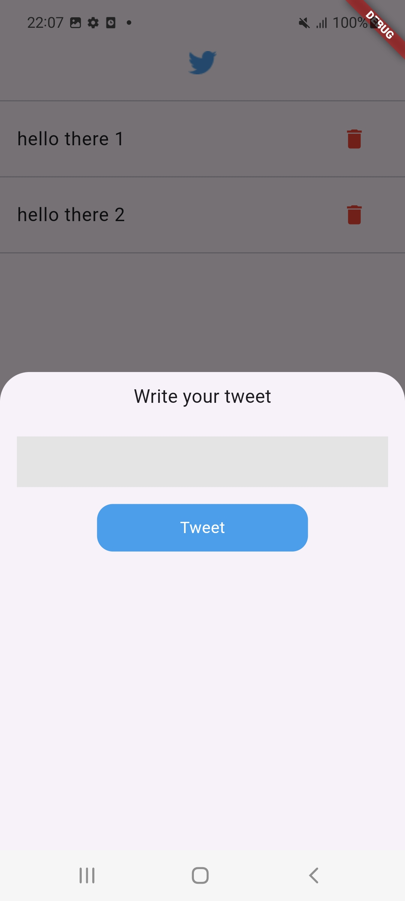

# Twitter-like App with Flutter

This Flutter project is a simple Twitter-like application that allows users to compose, view, and delete tweets. The project utilizes the `GetIt` package for dependency injection and `GetStorage` for local storage. The app features a user-friendly interface with a floating action button to compose new tweets.

## Setup and Installation

1. **Clone the Repository**:
   ```bash
   git clone https://github.com/turki-aloufi/get_it-Assignment.git
   cd get_it_assignment
   ```

2. **Install Dependencies**:
   Ensure you have Flutter installed. Then, run:
   ```bash
   flutter pub get
   ```

3. **Run the App**:
   ```bash
   flutter run
   ```


## Features

- **Compose Tweets**: Users can write new tweets using a modal bottom sheet.
- **View Tweets**: Display a list of tweets on the homepage.
- **Delete Tweets**: Users can delete tweets, and the list updates in real time.
- **Dependency Injection**: The `GetIt` package is used to manage the app's dependencies.
- **Local Storage**: `GetStorage` is used for persistent data storage.

## Project Structure

- **data_layer**: Contains the `TweetsData` class, which manages tweet data.
- **pages**: Contains the `HomePage` widget, which is the main interface of the app.
- **services**: Contains the `setup.dart` file for setting up dependencies.
- **widgets**: Contains reusable widgets like the tweet display and the floating action button.


## Screenshots

 home page


 add tweet

 


## Screen recording

<video controls src="assets/readme/Screen_Recording_20240828-221106.mp4" width="300" height="700">